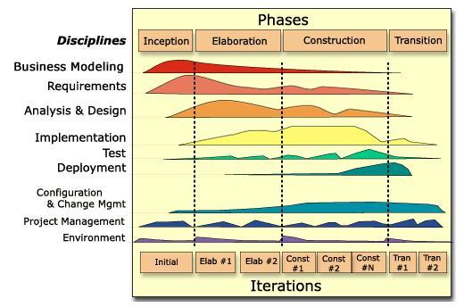
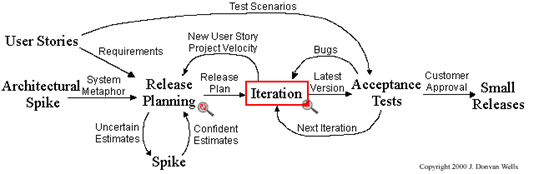

# 我们怎么从零开始构建一个系统？

## 项目背景

我们以人民银行推出”受益所有人管理“为例来展示怎么样从零开始构建一个新的系统。

 项目的背景是这样子的。

 ２０２５年人民银行在推出《受益所有人信息管理办法》的时候，首先出了一个征求意见稿，基于这个征求意见稿人民银行开始展开针对辖区内金融机构展开业务培训，以帮助金融机构理解《受益所有人信息管理办法》的业务要求。随后，人民银行在年度培训会上特别强调了《受益所有人信息管理办法》实施的重要性。当然， 后来才知道人民银行将受益所有人管理这块业务设置在上海分行，并单独设置了一个受益人处进行日常管理。

 在2025年底人民银行接着又推出了一个《受益所有人识别管理办法》，紧接着人行上海分行又推出了一个《受益所有人差异报告工作指引（征求意见稿）》。

> 更多的受益所有人相关的法律法规和监管指引请看[中国人民银行受益所有人监管文件汇总](uboreg.md)

  现在我们开始从零开始分析和构建受益所有人管理系统。从事后的角度上看，我们应该将这个受益所有人的实施分为三个阶段，第一个阶段是在２０２５年构建一个受益所有人前置系统里来对接人民银行端的受益所有人系统，第二个阶段是实施受益所有人管理办法要求的存量客户的受益所有人核验以及按照受益所有人差异报告工作指引的要求，完善金融机构内部的受益所有人前置系统，第三个阶段是从开户ＫＹＣ和ＣＤＤ开始增加对受益所有人的识别，并自动将这些要求收集好的受益所有人信息自动传送到客户数据管理系统，然后通过ＥＴＬ将客户数据传送至受益所有人前置系统。分成第三个阶段的原因是，目前开展开户系统针对受益所有人信息收集要求以及将开户、CDD和客户管理系统集成的时机不成熟，当时行内正在进行新核心系统的改造，无暇顾及这类的集成要求。

> - 我们使用的是IBM RUP模型
> - 我们还需要一些基础知识，比如说金融业关于KYC和CDD的知识，还有关于公司的架构标准和软件开发的技术栈等。
> - 这个文件试图给一些需求分析阶段，我们怎么使用AI来帮助系统分析员和业务分析员

下面的分析是以上述第二阶段为例来进行。

## `I1` - 业务建模和需求分析

借用IBM的RUP，我们可以称这个阶段为业务建模的 inception （`I1`）。在这个阶段，我们可以将监管条文喂给AI来要求AI提供一个业务流程图， 做为业务分析员和系统分析员（应用架构师），我们认为最重要的是可以理解清楚业务工作流，系统集成的功能要求。我是在人行上海给出《受益所有人差异报告工作指引（征求意见稿）》的时候， 将这个文件喂给AI请它去生成一个业务流程图。 我的实践经验是AI可以给出绝大部分的正确的流程，但是还是需要我们自己和用户一起去细化甚至更正，在确定这个流程图初稿后，我又把这个流程图和监管文件一起给AI请它做对比检查看有没有漏掉的地方， 最后实践下来这一步也是有用的。

图：BOMIS一期和二期实践对比

这个 `I1`阶段我们的主要任务是识别出这一期和上一期之间的新的工作流和/或功能点的改变等等，主要的目的是和用户统一思想。 这个时候需要解决的主要问题是我们和用户一起确定业务解决方案，包括这些监管要求涉及到哪些公司策略和流程的变更，哪些功能系统可以实现？哪些功能可能需要用户手工处理，这时候的输出可以用于立项（TOR）。

在这个阶段，我们还不需要创建 jira 的 user story。 上图的是在接下来的 `E1`阶段不断修改的。

在这个阶段，技术部分的输入主要是技术选型也就是XP说的system metaphor，能不能做、困难是不是很大，并给出比较粗的项目预算估计。

在这个阶段，我们提出了两个点一个是使用一个在线的markdown文本编辑器来对差异报告的工作文件和报告本身进行工作流管理，还提出了一个创新点使用AI来生成差异报告及其附件；在使用这张流程图和用户沟通的过程中用也提出了文件归档可以归档的行内的标准系统上，我们原先的方案是希望用户将文件手工上传的CDD系统， 我们并不想在本地保存这些敏感文件。我们在和架构师讨论时，他也不知道这个行内标准的文件归档系统；最后我们也和负责AI平台的同事达成了，调用AI生成文档，而不是将文档的工作流放在AI平台去生成的约定。

我们还可以要求AI提供一个合规性检查清单，这对这类监管相关系统非常重要。

有了这些内容后，我们就可以启动项目。

### 在 `I1`阶段AI的使用

* 对监管文件进行摘要以便尽快了解监管的要点，这些要点翻译后可以在以后的很多地方使用。
* 使用AI读取监管文件来生成业务流程图， 经过人工修改后再请AI复核。
* 使用AI生成TOR文件的框架，监管背景、 解决方案、里程碑计划、 风险分析、合规性检查清单等，文件经过手工编写完成后还可以请AI做一个复核。

## `E1` - 业务建模、需求分析和功能设计

在这一个阶段。我们需要拟定项目的核心功能模块列表，将上一阶段的用户故事归类到核心功能模块，所有的用户在核心模块之间不同的用户交互方式，也就是信息流转方式以及核心系统和其他系统的集成界面。
在这个阶段。我们继续优化流程图和用户故事地图，这时候的用户故事地图需要在 jira 上创建，需求管理人员需要使用特定句式来开始描述需求。
在这个时候。软件架构师需要思考用户功能模块与软件组件模块之间的实现关系。

在这个阶段，我们需要对工作流进行仔细的探讨和需要对接的系统联系以了解互相调用的方式。 下图是我们识别的差异报告，处理流程的有限状态图。

### 在 `E1`阶段AI的使用

* 是用AI读取监管文件来生成更加详细的业务流程图， 经过人工修改后再请AI复核。
* 使用AI生成用户故事地图，编写完成后还可以请AI做一个复核。

## `E2` - 详细需求分析和详细功能设计

在这个阶段业务分析员需要完成的事，将每一个用户故事在jira上面详细描述，按照下面的用户故事标准语法的标准来完成。同时业务分析员还需要准备一个完整的业务需求文档，在实践中这份文档应该也包含功能设计，也就是说也需要 应用架构师的输入。

- [ ] 使用jira/confleunce MCP来读取，jira 上面的用户故事描述进行检查

### Construction 阶段

* [ ] 这个阶段可以使用的方式是使用AI来生存测试场景和测试用例。

当然会有AI辅助编程，不过我们这里并不讨论。 通过上面的方式，我们应该可以 在AI的辅助下留下比较好的文档， 这些文档希望可以作为Specification driven development 和Claude skills 的高质量的输入，应该对开发有帮助，但是我们这里办法实践。

### Transition 阶段

* 在这个阶段，我们是用AI来帮助我们编制脚本，使得我们在没有上CD之前逐渐尝试，可以通过脚本自动化发布

## 使用jira 需求管理

以BOMIS 为例，我们创建一个 EPIC（BOMIS-1）来管理它的需求管理文档，或者说是 bomis的产品定义以及演化文档。
关于 BOMIS 我们一共规划了三个阶段，阶段一是构建系统，阶段二因应监管要求升级系统，阶段三是解决与行内系统的集成。我们以 BOMIS 作为核心，那么在这一个需求管理 epic 中也应该包含它与其他系统的集成。这里我们规划了三个集成，第一个是 BOMIS 与 Filenet的集成，第二是 bomis 和 HBCN 大语言模型平台的集成，第三个集成目前包含在阶段三。
需求管理是一个持续的过程。我们这里的实践是，需求可以拆解成为不同的用户故事。这些用户故事的交付可以通过不同的项目，也就是epie 来管理。项目经理在交付的过程中。可以使用用户故事地图来规划交付的 Sprint。
这些不同的用户故事通过“is child of”的jira 关系链接这些用户需求 jira。
严格来讲，我们需要一个将系统功能分模块的 Excel 用于展示这些功能是分别在哪一个项目的阶段来完成的。也就是说，这应该是一个全貌的用户故事地图。这个全貌的用户故事地图还应该有一个与软件架构组件之间的 matrix关系，这个文件就可以用于当全回归测试不可行的时候，采用的基于风险的回归测试的分析源头。
我们这里不讨论非功能性需求。

还是以bomis 为例，这个系统的出发点是监管的要求，你也可以换成是业务的要求。从原理上讲。首先需要了解监管要求或者业务的要求是什么？这个过程的结果文档可以先画一个BPMN流程图开始。这个流程图应该可以展示“作为<角色>，我想要<功能>，以便<价值>”。
有了流程图以后，可以尝试实现一个<角色＞与 功能＞的Matrix，然后将《功能》进行优先级调整。也就是实现一个初级的用户故事地图 （excel）。这个就是我们做需求管理的起点。

## 关于文档

我们的计划是使用AI来辅助我们编制项目的受控文档。

- [ ] 我们应该可以使用AI来检查发布的CO的填写以及其他的类似lesson learned中的问题， 我们有没有

## 附录

### IBM RUP

### IBM 4+1 架构视图模型

4+1视图模型是一种用于"基于多重视图描述软件密集型系统架构"的[描述框架](https://public.dhe.ibm.com/software/dw/rational/pdf/Views_and_viewpoints.pdf "Introduction to the IBM Views and Viewpoints Framework")。该模型通过不同利益相关者（如终端用户、开发者、系统工程师、项目经理）的视角描述系统，包含逻辑视图、开发视图、进程视图、物理视图四大核心视图，并选取用例或场景作为第五个补充视图（即"+1"）来演示架构，故称4+1视图模型:

- 逻辑视图：关注系统向终端用户提供的功能，通常采用UML类图、状态图等图表进行描述。
- 进程视图：处理系统动态特征，阐述系统进程间的通信与运行时行为，关注并发性、分布式、性能与可扩展性等问题，常用UML顺序图、通信图、活动图表示。
- 开发视图：从程序员视角展现系统，侧重于软件管理，通过UML包图、组件图进行描述。
- 物理视图：从系统工程师角度描述软件组件在物理层的拓扑结构及组件间物理连接，采用UML部署图表示。
- 场景视图：通过一组精选的用例场景构成第五视图，描述对象与进程间的交互序列，用于识别架构元素、验证架构设计，并作为架构原型测试的起点，亦称用例视图。

4+1视图模型具有通用性，不局限于特定标注工具或设计方法。正如克鲁赫顿所述：

> "4+1视图模型本质是通用的：可使用其他标注工具或设计方法，特别是在逻辑与进程分解方面，但我们所列举的是实践中验证有效的方法。
>
> ——菲利普·克鲁赫顿 [《架构蓝图——软件架构的&#34;4+1&#34;视图模型》](https://www.cs.ubc.ca/~gregor/teaching/papers/4+1view-architecture.pdf "Architectural Blueprints—The “4+1” View Model of Software Architecture")

您图片中的表格可以转换为以下 Markdown 格式：

| 4+1 View    | IBM IT system viewpoint                            | UML              |
| ----------- | -------------------------------------------------- | ---------------- |
| Logical     | Functional                                         | 系统的逻辑架构图 |
| Process     | Functional, Operational, Performance, Availability | 时序图和流程图   |
| Physical    | Operational                                        | 部署图           |
| Development | Functional                                         | 组建图           |
| Use Case    | Requirements                                       | 用例图           |

参考：

- [详解系统架构的“4+1”视图](https://www.zhihu.com/tardis/zm/art/352590602?source_id=1005 "详解系统架构的“4+1”视图")

### XP

先上图

### 在软件开发中描述用户故事的标准语法

在软件开发中，描述用户故事（User Story）的标准语法在软件开发中，描述用户故事 （User Story）的标准语法是“作为<角色>，我想要<功能>，以便<价值>”（As a  `<Role>`， I want <Peature〉， so that <Value〉）。这个三段式模板由敏捷开发先驱 Ron Jeffries 提出，是擄提用户蓄家的核心工具。
这个句式的精妙之处在于强制团队从用户视角思考：

- 角色（Role）頭确功能的使用者（如“文档发布员”“消費者”），避免开发脱商实际用户：
- 功能（Feature）描述用户喬要的具体操作（如“手动刷新 CDN 级存”“在网上购买化妆品”），聚焦“做什么”而非“怎么候”；
- 价值（Value）揭示功能背后的业务目标（如“释放运维人力”“没空出门时也能問时补给”），直接影响禽求优先级推序。
  实例：
  作为〈电商平台消费者>，我想要《筛选商品时按销量排序〉，以便<快速找到最受欢迎的产品>。
  这个故事清晰传道了：谁便用（消費者）、做什么（销量轉序）、为什么雷要（快速找到热门商品）。若需补充细节，可通过 “Given-When-Then”格式定义验收标准，例如：
  Given 我在商品列表页，when点击“销量”推序按钮，Then 商品按月销量从商到低展示。
  这种结构化表达避免了“为功能而功能”的误区, 就像古代传令官需要的不是“飞机”，而是“更快到达目的地”。记住：用户故事的灵魂不是格式，两是“让团队理解用户真实需求”。你在实际项目中是否通到过因忽略“价值”都分导致开发偏离用户期望的情况？
