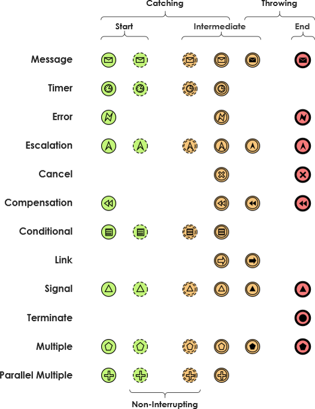
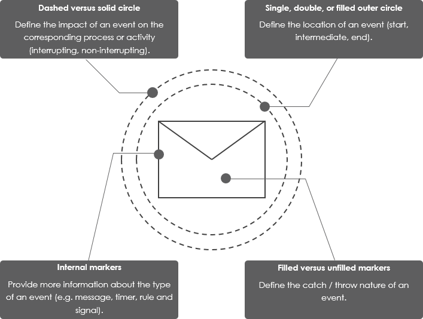
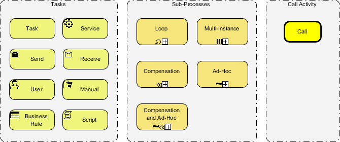
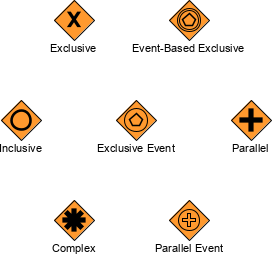

# 从入门到精通：Draw.io绘制BPMN流程图的全面修炼指南

在当今数字化商业环境中，业务流程建模与表示法(BPMN)已成为企业流程管理、优化和自动化的标准语言；作为产品经理、业务分析师、运营流程专家、项目经理、软件工程经理、工作流软件开发人员在工作中都需要使用标准的流程建模方法和图标来绘制流程图并与有关人员就某个的流程AS-IS 和TO-BE进行讨论等。我们接触到的流程有：

1. 客户的全生命周期管理、证券清算流程、支付清算流程业务流程，在这些流程中，有系统处理的流程也有需要运营人员使用系统操作的流程
2. 产品研发、需求管理
3. （软件）工程项目管理
4. Service manageemnt - incident management
5. 某个专业流域的管理流程，例如数据治理、root cause analysis等
6. 专门的客户服务、风险管理流程等

Draw.io(现更名为Diagrams.net)作为一款免费、开源且功能强大的图表工具，是学习和实践BPMN的理想选择。本指南以一个软件开发的流程管理为例，将为您提供一条从零基础到BPMN专家的系统学习路径，涵盖基础概念掌握、工具熟练使用、高级技巧应用以及实战经验积累，先从一个简单的Orchestration 流程, 扩张到collaboration流程以及Choreography来详细介绍BPMN 2.0.

> [!Tip]
> 1. 使用[在线drawio 应用](https://app.diagrams.net/)
> 1. 下载[drawio desktop](https://www.drawio.com/)
> 2. 或者使用VS Code 的[drawio 插件](https://marketplace.visualstudio.com/items?itemName=hediet.vscode-drawio)

## 第一阶段：BPMN与Draw.io基础奠基

### 1.1 理解BPMN核心概念

BPMN(Business Process Model and Notation)是一种图形化的业务流程建模标准，它通过统一的符号体系帮助业务人员与技术人员有效沟通。要掌握BPMN，首先需要理解其基本构成元素，我们通过一个简单的流程图来示例。

![ ] TODO

* **流元素(Flow Objects)**：包括事件(圆形)、活动(矩形)和网关(菱形)，这三者是BPMN的核心构件。事件表示流程中发生的事情，活动是需要完成的工作，网关则控制流程的分支与合并。
* **连接对象(Connecting Objects)**：主要是顺序流(实线箭头)、消息流(虚线箭头)和关联(点线)，它们将流元素连接起来形成完整流程。
* **泳道(Swimlanes)**：包括池(Pool)和道(Lane)，用于划分不同部门或角色在流程中的职责。泳道能够清晰地展示跨部门协作的流程。
* **数据对象(Data Objects)**：表示流程中产生、使用或传递的数据，如文档、数据库等。
* **人工信息(Artifact)**:

### 1.2 Draw.io工具入门

Draw.io是一款完全免费的在线图表工具，支持多种图表类型包括BPMN。作为初学者，你需要：

1. **访问与界面熟悉**：直接访问官网app.diagrams.net即可开始使用，无需注册或安装。首次使用时，Draw.io会提供简短教程引导你了解界面布局，包括菜单栏、工具栏、绘图区域和侧边栏。
2. **创建第一个BPMN图**：
   * 新建文件后，在左侧形状库中找到并启用"BPMN"图形集
   * 尝试拖拽开始事件、任务和结束事件到画布
   * 使用连接工具将它们按顺序连接起来
3. **基本操作掌握**：
   * 图形添加与删除
   * 连接线的绘制与调整
   * 文本编辑与格式设置
   * 画布缩放与平移
4. **保存与导出**：Draw.io支持将图表保存到本地设备(如XML、PNG格式)或云端服务(Google Drive、OneDrive等)。

### 1.3 绘制简单业务流程

掌握了基本概念和工具操作后，可以尝试绘制一些简单业务流程：

1. **线性流程**：如"请假申请流程"——开始→提交申请→经理审批→结束。这种三到五个步骤的流程可以帮助你熟悉元素连接和基本布局。
2. **包含分支的流程**：在审批环节加入网关，根据条件不同走向不同路径，如"审批通过→通知申请人"和"审批拒绝→结束流程"。
3. **跨角色流程**：使用泳道(Pool)区分不同部门的职责，如将申请人和HR部门放在不同的泳道中。

## 第二阶段：BPMN标准深入与Draw.io技能提升

### 2.1 精通BPMN符号体系

要成为BPMN专家，必须深入理解各种符号的细微差别和使用场景：

* **事件类型**：开始事件(单细线圆)、中间事件(双线圆)和结束事件(粗线圆)，每种事件又可分为多种类型如消息事件、定时事件、错误事件等。
* **网关类型**：
  * 排他网关(XOR)：只有一个路径会被选择
  * 并行网关(AND)：所有路径同时执行
  * 包容网关(OR)：满足条件的路径都会执行
  * 事件网关：基于事件而非数据的决策点
* **活动类型**：
  * 任务：不可再分的工作单元
  * 子流程：可展开的复合活动，用带小加号的矩形表示
  * 循环活动、多实例活动等特殊类型
* **高级元素**：
  * 补偿活动：用于错误恢复的特殊活动
  * 事务：具有ACID属性的活动组
  * 事件子流程：由事件触发的嵌套子流程

### 2.2 Draw.io高效使用技巧

熟练使用工具能大幅提升BPMN绘图效率和质量：

1. **快捷键掌握**：
   * Ctrl+C/Ctrl+V：复制粘贴
   * Ctrl+Z/Ctrl+Y：撤销重做
   * Ctrl+鼠标滚轮：缩放画布
   * 按住空格键+拖动：平移画布
2. **批量操作**：
   * 多选：按住Ctrl(Windows)或Command(Mac)点击多个元素
   * 批量修改样式：多选后通过右侧格式面板统一调整
   * "选择相同"功能：快速选中所有同类元素
3. **连接线优化**：
   * 使用"连接点"精确控制连线位置
   * 调整连接线路径点避免交叉
   * 设置跳线(Jump)使交叉线更清晰
4. **图层与页面管理**：
   * 复杂流程图可分页绘制
   * 使用图层控制不同元素的显示
5. **模板与样式库**：
   * 创建自定义模板复用常用设计
   * 建立样式库保持企业标准

### 2.3 绘制中等复杂度业务流程

结合BPMN知识和工具技巧，可以开始挑战更复杂的业务场景：

1. **并行流程**：使用并行网关描述同时进行的多个任务，如订单处理中的"库存检查"、"支付验证"和"物流安排"可并行执行。
2. **错误处理流程**：通过中间错误事件和补偿活动描述异常处理逻辑，如"支付失败→重试/取消订单"。
3. **事件驱动流程**：使用消息事件、定时事件等描述异步流程，如"提交申请→等待审批→超时自动拒绝"。
4. **多角色协作流程**：使用多个池(Pool)和消息流描述跨系统或跨组织的交互，如"客户系统→电商平台→支付网关"的订单流程。

## 第三阶段：高级BPMN模式与专业应用

### 3.1 掌握BPMN高级模式

真正的BPMN专家不仅了解符号，还能运用高级建模模式解决复杂业务问题：

1. **事务模式**：将一组活动作为原子事务处理，全部成功或全部回滚，适用于支付、库存变更等关键操作。
2. **补偿模式**：定义专门的补偿活动来处理已成功完成但后续失败的活动，如"预订成功但支付失败→取消预订"。
3. **多实例模式**：描述需要多次执行的活动，如"批量处理100个订单"，可以是顺序或并行执行。
4. **事件子流程**：创建由事件触发的子流程，用于处理异常或特定条件，如"订单超时监控"。
5. **编排与协作模型**：
   * 编排(Orchestration)：从单一视角描述流程
   * 协作(Choreography)：强调参与者间的交互

### 3.2 Draw.io高级功能应用

充分利用Draw.io的高级功能可以提升专业级BPMN绘图效率：

1. **版本控制**：由于Draw.io以XML格式保存文件，可与Git等版本控制系统集成，管理流程图变更历史。
2. **团队协作**：通过Google Drive、OneDrive等云存储实现多人实时协作编辑。
3. **自动化与API**：
   * 使用Draw.io的API自动生成流程图
   * 将CSV数据转换为组织结构图或流程图
4. **企业部署**：考虑私有化部署Draw.io企业版，满足数据安全合规要求。
5. **与其他工具集成**：
   * 通过插件与Confluence、Jira等系统集成
   * 导入Visio文件继续编辑
   * 导出为多种格式嵌入文档

### 编程

bpmn-js

mxGraph - drawio

### 3.3 复杂业务流程建模实战

将高级BPMN知识应用于实际业务场景：

1. **端到端业务流程**：如电商平台从"订单创建→支付→库存扣减→物流发货→客户签收→售后"的全生命周期。
2. **异常处理密集型流程**：如保险理赔流程，考虑各种拒绝情形、补充材料请求、部分赔付等复杂场景。
3. **系统集成流程**：描述多个系统间的交互，如ERP与CRM系统的数据同步流程，使用消息流和调用活动。
4. **行业特定流程**：
   * 银行业：贷款审批流程
   * 医疗业：患者就诊流程
   * 制造业：生产质量控制流程

## 第四阶段：BPMN最佳实践与持续精进

### 4.1 BPMN建模最佳实践

成为专家不仅需要技术能力，还需要掌握行业最佳实践：

1. **分层设计原则**：
   * 顶层：价值链级别的端到端流程
   * 中层：部门级别的协作流程
   * 底层：可执行的操作级流程
2. **清晰性优先**：
   * 避免过度复杂，适当使用子流程
   * 保持一致的符号使用规范
   * 合理使用注释和颜色强调
3. **业务与技术平衡**：
   * 业务视图：关注可读性，省略技术细节
   * 技术视图：包含执行细节，用于自动化
4. **常见误区避免**：
   * 符号混用或不规范
   * 遗漏异常处理路径
   * 泳道划分不合理

### 4.2 持续学习资源

即使达到专家水平，BPMN和Draw.io也在不断发展，需要持续学习：

1. **官方文档**：
   * BPMN 2.0标准文档(OMG)
   * Draw.io官方帮助文档
2. **在线课程**：
   * 慕课网的BPMN系列课程
   * Camunda等BPM平台提供的培训
3. **社区参与**：
   * BPMN官方论坛
   * Draw.io的GitHub社区
   * Camunda社区
4. **认证考试**：
   * OMG-Certified Expert in BPM 2.0
   * Camunda BPM认证

### 4.3 实际项目经验积累

最终，真正的专家需要在真实项目中磨练：

1. **从简单项目开始**：如部门内部流程文档化
2. **参与跨部门项目**：体验不同视角的需求
3. **尝试流程自动化**：将BPMN图转换为可执行模型
4. **流程优化项目**：通过建模识别瓶颈和改进点

腾讯云开发者社区的文章强调了BPMN在业务流程改进中的实际应用价值。

## 学习路线图总结

为方便您系统性地规划学习路径，以下是简明的阶段总结：

| 阶段                        | 主要内容                                                 | 预期成果                   | 参考资源 |
| --------------------------- | -------------------------------------------------------- | -------------------------- | -------- |
| **初级阶段**``(1-2周) | BPMN基本元素认知 ``Draw.io界面熟悉``简单线性流程绘制     | 能绘制无分支的简单业务流程 |          |
| **中级阶段**``(2-4周) | BPMN符号体系精通 ``Draw.io高效技巧``含网关和泳道的流程   | 能设计部门级协作流程图     |          |
| **高级阶段**``(4-8周) | BPMN高级模式掌握 ``Draw.io团队协作功能``复杂异常处理流程 | 能建模端到端企业级流程     |          |
| **专家阶段**``(持续)  | BPMN最佳实践 ``流程优化与自动化``行业特定方案设计        | 能领导业务流程转型项目     |          |

通过这条系统化的学习路径，配合持续的实践和反思，您将逐步成长为真正的Draw.io和BPMN专家，能够在企业业务流程管理、优化和自动化项目中发挥关键作用。记住，BPMN不仅是一种绘图技能，更是一种业务流程思维方式的培养，这将使您在数字化转型浪潮中保持竞争优势

## BPMN Elements

### Flow Objects

#### Events

#### Activities

BPMN activities types

#### Gateways

* [Visual Paradigm BPMN gateway types](https://www.visual-paradigm.com/guide/bpmn/bpmn-gateway-types/)

## 其他有用的信息

1. [Visual Paradigm - guide](https://www.visual-paradigm.com/cn/guide/)
2. [Visual Paradigm - what is BPMN](https://www.visual-paradigm.com/guide/bpmn/what-is-bpmn/)
3. [Visual paradigm - learning BPMN events](https://www.visual-paradigm.com/guide/bpmn/bpmn-events/)
4. [Visual paradigm - types of gateway in BPMN](https://www.visual-paradigm.com/guide/bpmn/bpmn-gateway-types/)
5. [BPMN 2.0 Symbol Reference](https://camunda.com/bpmn/reference/)
6. https://www.lucidchart.com/pages/tutorial/bpmn-symbols-explained
7. [Open source workflow - activiti](https://www.activiti.org/)
8. 使用BPMN fonts - [bpmn fronts](https://github.com/bpmn-io/bpmn-font)
