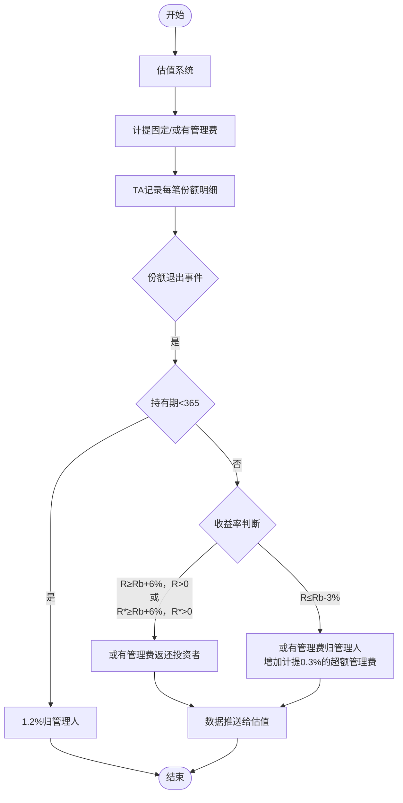

# 公募基金浮动管理费需求分析

## 业务概述

### 改造背景

> [!Tip]
>
> - 这个行业讲的是，金融业务、监管要求和金融科技；这篇文章属于谈“金融业务、监管要求”，作为产品经理，你是有机会在其他的地方谈些金融科技的，比如 AI 算法
>
> - 需要有监管文件原文出处
>
> - 需要概括需求并解释管理层的想法，产品经理负责向内部的业务需求管理人员以及软件工程团队解读和解释金融业务和管理层的意图是怎么实现的，这需要从产品设计以及运营流程上考虑
>
> - 参考项目启动文档 Project Charter (项目章程）)，业界一般叫TOR (Terms of Reference),将 PMP 应用到你的工作,如果能将产品的推出和改进分不同的纬度（范围，时间，成本和交付质量）来考虑的话，这样更好
>
> - 可以适当补充下面的文字

为落实监管关于“浮动管理费率挂钩基金业绩表现”的要求，主动权益类基金需建立**以业绩为导向的管理费计提与归属机制**，提升投资者获得感。

### 适用范围

本浮动管理费机制适用于新设立的主动权益类公募基金，尤其是基金合同中采用“业绩比较基准挂钩费率”机制的产品类型。

> [!Tip]
>
> - 增加一句类似，主动权益类基金的管理费在“固定管理费“之外，新增了，”或有管理费“和”浮动管理费“。

|  |  |  |  |  |
| --- | --- | --- | --- | --- |
| 管理费类型 | 年费率 | 计提方式 | 是否每日入账 | 是否和赎回收益挂钩 |
| 固定管理费 | $0.6\%$ | 按基金净值每日计提 | 是 | 否 |
| 或有管理费 | $0.6\%$ | 按基金净值每日计提 | 是 | 是 |
| 浮动管理费 | $0.3\%$ | 按基金净值每日预估（不入账） | 否 | 是（特定条件） |

### 不适用产品范围

> [!Tip]
>
> - 增加一句类似，主动权益类基金的管理费在“固定管理费“之外，新增了，”或有管理费“和”浮动管理费“。

- FOF（基金中的基金）
- QDII（合格境外投资产品）
- TN类产品

## 触发浮动管理费核算的条件与计算逻辑

### 触发浮动管理费核算的相关流程图

> [!Tip]
>
> - 一般来说，先画张图，再解释；思维的时候也这样做
>
> - 下面这张图应该可以“份额退出事件开始”

### 管理费归属判定点

在以下任一操作发生时，对应持有份额触发**管理费最终归属判断**：

- 基金赎回
- 转换转出
- 清盘（基金合同终止）
- 判定逻辑图解

|  |  |  |
| --- | --- | --- |
| 情形 | 判定条件 | 管理费处理 |
| 短期持有 | 持有 $`< 365`$ 天 | $`1.2\,\%`$ 全额归管理人（$`0.6\,\%`$ 固定 $`+ 0.6\,\%`$ 或有） |
| 长期未达基准 | $`R \leq R_b - 3\,\%`$ | 或有管理费全部返还投资者 |
| 长期达标未超基 | 其他情况 | 或有管理费归管理人 |
| 显著超越基准 | $`R > R_{b} + 6\%,R^*>R_{b}+6\%`$，且 $`R`$、$`R^*>0`$ | 或有管理费归管理人 $`+`$ 扣 $`0.3\,\%`$ 超额管理费 |

#### **$R_{b}$（业绩比较基准）的计算方式**

业绩比较基准 $R_{b}$ 是指：基金合同设定的参考收益率，用于判断基金业绩是否达标。

TA系统每日跟踪该指数组合的走势，计算投资者持有期间的年化基准收益率 $R_{b}$，计算公式为:

$$R_b = \frac{\text{期末基准点位} - \text{期初点位}}{\text{期初点位}} \times \frac{365}{T} \times 100\%$$

- 期初/期末点位：来自基金合同中约定的指数组合（日行情数据导入）；
- $T$：投资者持有天数；
- 业绩基准示例：上证指数 $×70%$ + 恒生指数 $×10%$ + 一年期定存利率 $×20%$。

系统支持每日更新基准点位，自动累计到份额明细，用于赎回时判断是否返还管理费或触发超额管理费。

#### **$R$（持有期间年化收益率）的计算公式**

$$
R = \frac{\mathrm{NAV}_1 - \mathrm{NAV}_0}{\mathrm{NAV}_0} \times \frac{365}{T} \times 100\%
$$

- $NAV_{0}$：份额确认日累计净值；
- $NAV_{1}$：赎回日或合同终止日累计净值；
- $T$：持有天数。

#### **$R^*$（扣除超额管理费后的修正年化收益率）的计算公式**

$$R^* = \frac{F \times (\mathrm{NAV}_1 - \mathrm{NAV}_0) - M}{F \times \mathrm{NAV}^*_0} \times \frac{365}{T} \times 100\%$$

$F$：该笔赎回份额；

$M$：该笔份额累计计提的超额管理费；

$NAV^*_{0}$：初始单位净值（非累计）；

系统将基于 $R$ 和 $R^*$ 双重判断，确定是否触发超额管理费收取。

## 系统职责与改造点

### 估值系统

> [!Tip]
>
> 一般来说，这里是需要有些文字的

|  |  |
| --- | --- |
| 任务 | 说明 |
| 每日计算固定管理费 | $0.6\%$，每日实际计提 |
| 每日计算或有管理费 | $0.6\%$，每日实际计提 |
| 不计算超额管理费 | 由TA系统处理，仅接受<应该是接**收**>归属信息 |
| 输出管理费归属明细 | 提供给托管、TA、基金公司使用 |
| 支持 NAV/基准点位文件生成 | 为收益率计算服务 |

### TA系统

> [!Tip]
>
> 一般来说，这里是需要有些文字的

|  |  |
| --- | --- |
| 任务 | 说明 |
| 每日分摊或有管理费到份额明细 | 按静态+动态份额逻辑 |
| 每日预估超额管理费 | 记录但不计提，不影响份额净值 |
| 持有期+收益率判断逻辑 | 结合$\frac{\mathrm{NAV}_0}{\mathrm{NAV}_1}$、业绩比较基准 |
| 赎回/转换/清盘事件判断 | 决定返还 or 扣除 or归属管理人 |
| 生成归属结果推送 | 输出销售商、估值、客服接口所需字段 |
| 支持转托管/非交易过户 | 管理费明细随份额转出带走 |

### 业务控制与特殊场景处理

> [!Tip]
>
> 一般来说，这里是需要有些文字的

|  |  |
| --- | --- |
| 场景 | 说明 |
| 清盘 | 等同全量赎回，执行相同管理费判定 |
| 转换 | 转出份额先进行管理费归属判断，返还/扣除后转入新基金 |
| 非交易过户 | 管理费按份额比例随份额明细迁移 |
| 不支持产品类型 | 本机制不支持 FOF、QDII、TN 类产品 |

## 名称说明

> [!Tip]
>
> 可以增加些名词说明
